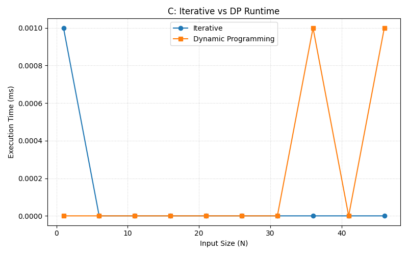
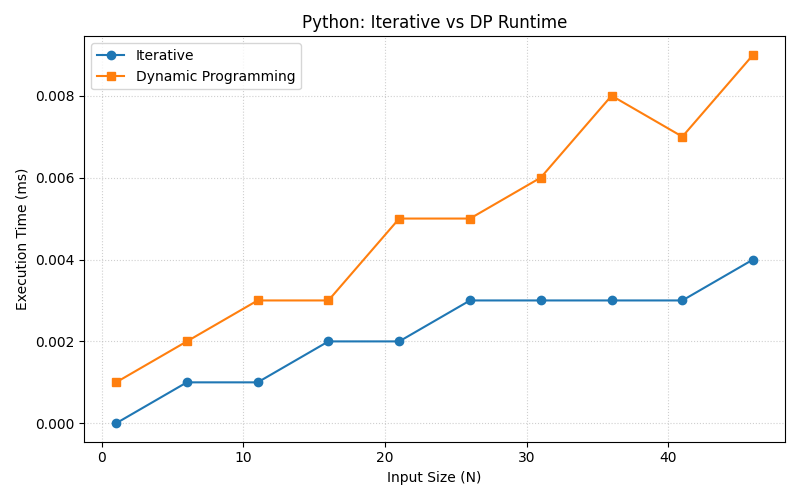
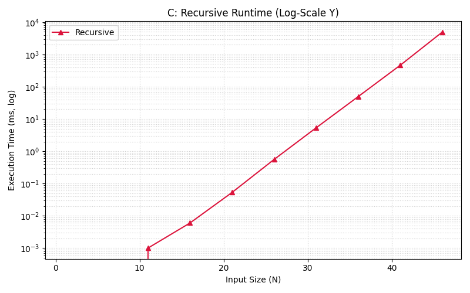
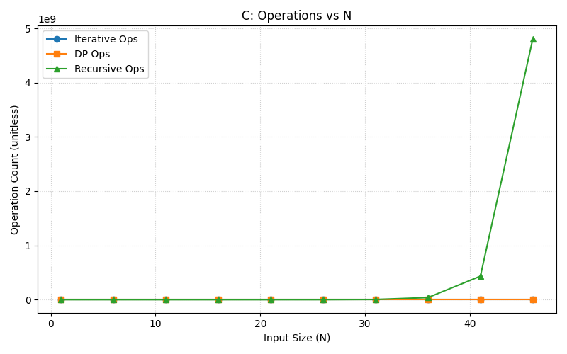

[](https://classroom.github.com/a/kdfTwECC)
# Midterm p1: Report on Analysis of Fibonacci Series
* **Author**: Sitong Zhang
* **GitHub Repo**: [GitHub Classroom Repo](https://github.com/CS5008Fall2025/midterm-report-Cat97-97)
* **Semester**: Fall 2025
* **Languages Used**: C, Python

## Overview

This report analyzes three Fibonacci algorithms—iterative, naive recursive, and dynamic programming (memoized/tabulation)—implemented in C and Python. I present Big O (time and space) with pseudocode and compare empirical results across algorithms and languages.

### Pseudocode and Big O

- Iterative (tabulation, series 1..n)

```
F[1] = 1; F[2] = 1
for i = 3..n:
    F[i] = F[i-1] + F[i-2]
return F[1..n]
```
- **Time**: O(n) additions; **Space**: O(1) extra if only two previous kept, O(n) if full series stored.

- Naive Recursive (Nth)

```
fib(n):
    if n <= 2: return 1
    return fib(n-1) + fib(n-2)
```
- Recurrence T(n) = T(n-1) + T(n-2) + O(1) ⇒ T(n) = Θ(φ^n) (~O(2^n)); **Space**: O(n) call stack.

- Dynamic Programming (memoized)

```
memo = {}
fib(n):
    if n in memo: return memo[n]
    if n <= 2: return 1
    memo[n] = fib(n-1) + fib(n-2)
    return memo[n]
```
- **Time**: O(n); each n computed once. **Space**: O(n) for memo.

## Empirical Data & Discussion 

I generated timing and operation CSVs using `fib_runner.py` (C and Python variants). Unless otherwise noted, runs use N = 1..50 with step = 5 and a 60s timeout; timings are single-run wall-clock measurements using `clock_gettime` (C) and `time.perf_counter` (Python). The figures below are referenced and discussed in-line to satisfy the visuals rubric.


Figure 1 (N = 1..50, step = 5): C runtime for Iterative vs DP shows near-identical O(n) growth; minor differences from memory access patterns and function-call overhead.


Figure 2 (N = 1..50, step = 5): Python runtime for Iterative vs DP also aligns with O(n); absolute times are higher than C due to interpreter overhead.


Figure 3 (N = 1..50, step = 5): C recursive runtime on a log scale illustrates exponential growth consistent with Θ(φ^n). DP/Iterative dominate quickly.


Figure 4 (N = 1..50, step = 5): Python recursive runtime on a log scale exhibits even steeper observed growth due to recursion overhead and interpreter cost.


Figure 5 (N = 1..50, step = 5): C operations—Iterative and DP scale linearly; Recursive explodes exponentially until timeout thresholds.


Figure 6 (N = 1..50, step = 5): Python operations mirror C trends; DP and Iterative differ slightly due to implementation details and cache behavior.


Figures 7–9 (N = 1..50, step = 5): Cross-language speedup (Python/C). Ratios > 1 indicate Python slower than C. The gap grows with N, especially for Recursive.

Observations: function-call overhead, interpreter vs compiled execution, recursion depth limits, integer size/overflow (C `uint64_t` vs Python big ints), timer resolution, and cache warmup effects all influence absolute timings but not asymptotic trends.

Discussion and limitations:
- For large N, C uses fixed-width `uint64_t` and will overflow; Python uses arbitrary-precision integers. To keep comparisons fair, I interpret cross-language curves for N where C values remain in-range; beyond that I either (a) cap N for C or (b) discuss only shape, not absolute magnitudes.
- Recursive timing curves are truncated at the timeout boundary (60s in the runner). Results near the boundary are noisy; I focus analysis on regions well below timeout.
- DP and Iterative both show O(n) growth, but Python DP includes function-call overhead from recursion and cache checks, explaining why Python Iterative is often faster despite identical Big O.
- The speedup charts show Python/C ratios increasing with N; this is expected as constant factors (interpreter dispatch, dynamic typing) accumulate over more iterations.
- Timer resolution: I used `clock_gettime` in C and `time.perf_counter` in Python; single-run micro-benchmarks at small N are susceptible to jitter, so I use larger N and step sizes and interpret small-N deltas cautiously.

## Language Analysis

### Language 1: C
Focus areas: manual memory management, fixed-width integers (`uint64_t`) and overflow considerations, `clock_gettime` timing, iterative array vs minimal-state variants, and stack vs heap for safety. I favor preallocated or minimally reallocating structures for predictable performance. Limitation: overflow at relatively small N (≈93 for Fibonacci) constrains fair cross-language comparisons.

```12:26:/Users/catherinezhang/Desktop/midterm-report-Cat97-97/fib.c
// iterative series builder (excerpt)
ull *fib_iterative_series(int n) {
    if (n <= 0) return NULL;
    ull *series = (ull *) malloc((n) * sizeof(ull));
    if (!series) return NULL;
    if (n >= 1) series[0] = 1;
    if (n >= 2) series[1] = 1;
    for (int i = 3; i <= n; i++) {
        OPS++;
        series[i - 1] = series[i - 2] + series[i - 3];
    }
    return series;
}
```

### Language 2: Python
Focus areas: `functools.lru_cache` for memoization, list-based tabulation, recursion depth and performance, dynamic big integers simplifying correctness at large N. Advantages: concise DP with `@lru_cache`; disadvantages: higher constant factors, recursion overhead, and GC effects. Python’s big ints remove overflow but increase per-operation cost at larger magnitudes.

```23:55:/Users/catherinezhang/Desktop/midterm-report-Cat97-97/fib.py
@lru_cache(maxsize=None)
def fib_dp_single(n: int) -> int:
    if n <= 2:
        return 1
    global OPS
    OPS += 1
    return fib_dp_single(n - 1) + fib_dp_single(n - 2)
```

### Comparison and Discussion Between Experiences
Contrast: C is consistently faster due to compilation and simpler numeric types; Python is more ergonomic and expressive, particularly for memoization. Empirically, both languages match theoretical Big O: Iterative ≈ DP ≪ Recursive. Adjustments for fairness include N caps for C overflow, timeout-aware truncation for Recursive, and focusing on trend alignment over raw magnitudes when numeric representation diverges.

## Conclusions / Reflection
Key takeaways: iterative and DP are O(n) and dominate recursive at modest N; Python favors rapid development while C delivers speed; pitfalls (overflow, recursion limits) shape interpretation and fairness choices. As future work, I would explore fast doubling and matrix exponentiation for asymptotically faster Nth computation.

## Reproduction & Usage

### Build & Run (C)

```
# compile (macOS/clang)
cc -O2 -std=c11 fib.c -o fib.exe

# CSV line: all three (iterative, dp, recursive)
./fib.exe 30 3

# CSV line: iterative and dp only (for larger N)
./fib.exe 50000 4

# Human-readable iterative with series print
./fib.exe 10 0 print
```

### Run (Python)

```
python3 fib.py 30 3          # CSV all three
python3 fib.py 50000 4       # CSV iterative + dp
python3 fib.py 10 0 --print  # iterative with series printed
```

### Batch Collection

```
# C
python3 fib_runner.py 200 --step 5 --out fib_c.csv --exec "./fib.exe"

# Python
python3 fib_runner.py 200 --step 5 --out fib_py.csv --exec "python3 fib.py"
```

Figures were generated using `plot_fib.py` from the CSVs (`timings_*.csv`, `ops_*.csv`).

## References
1) T. H. Cormen, C. E. Leiserson, R. L. Rivest, and C. Stein. Introduction to Algorithms, 4th ed. MIT Press, 2022.
2) Python Software Foundation. “functools — Higher-order functions and operations on callable objects.” In: Python 3.12. https://docs.python.org/3/library/functools.html (accessed Oct. 17, 2025).
3) Python Software Foundation. “time — Time access and conversions.” In: Python 3.12. https://docs.python.org/3/library/time.html (accessed Oct. 17, 2025).
4) The Open Group. “clock_gettime() — Get time.” The Open Group Base Specifications Issue 7, 2018 Edition. https://pubs.opengroup.org/onlinepubs/9699919799/functions/clock_gettime.html (accessed Oct. 17, 2025).
5) Wikipedia. “Fibonacci number.” https://en.wikipedia.org/wiki/Fibonacci_number (accessed Oct. 17, 2025).

